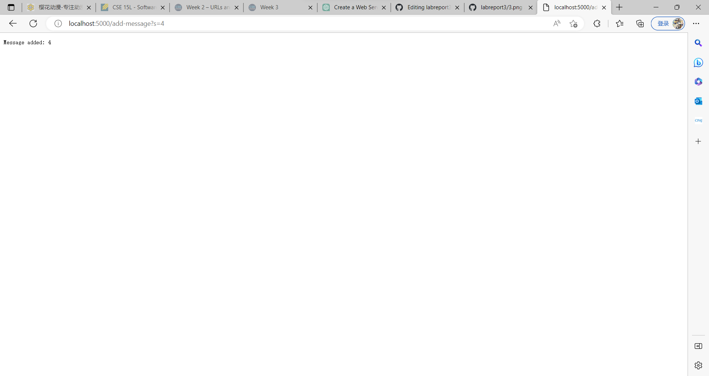
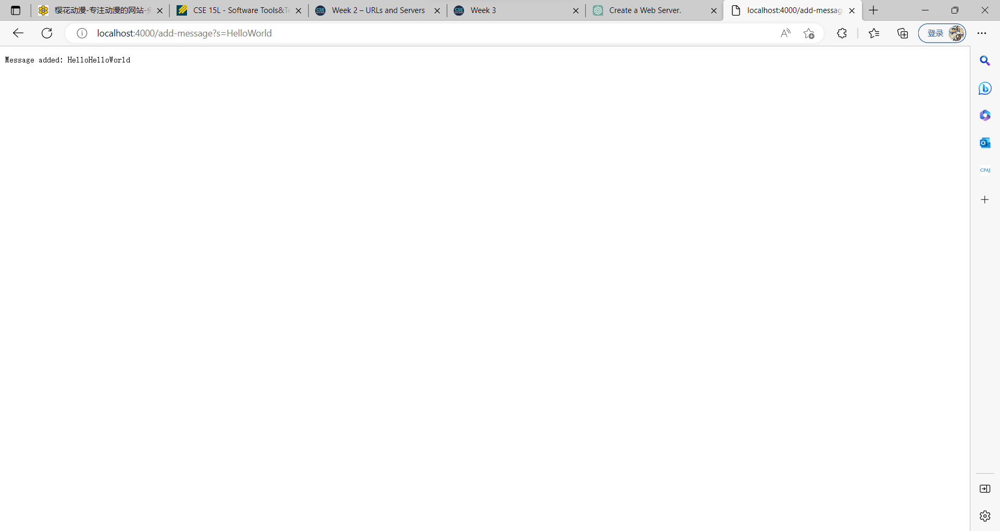
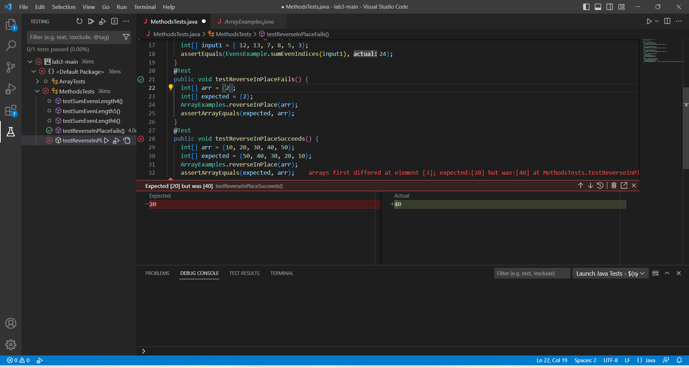

##Part1

import java.net.URI;
import java.util.ArrayList;
import com.sun.net.httpserver.HttpExchange;
import com.sun.net.httpserver.HttpHandler;
import com.sun.net.httpserver.HttpServer;
import java.io.IOException;
import java.io.IOException;
import java.net.URI;

class StringServerHandler implements URLHandler {
    String message = "";

    public String handleRequest(URI url) {
        if (url.getPath().equals("/")) {
            return String.format("Message: %s", message);
        } else if (url.getPath().equals("/add")) {
            if (url.getQuery() != null && url.getQuery().startsWith("s=")) {
                message += url.getQuery().substring(2);
                return String.format("Message added: %s", message);
            }
            return "Invalid request!";
        } else if (url.getPath().equals("/add-message")) {
            String s = url.getQuery();
            if (s != null && s.startsWith("s=")) {
                message += s.substring(2);
                return String.format("Message added: %s", message);
            }
            return "Invalid request!";
        } else {
            return "404 Not Found!";
        }
    }
}
public class StringServer {
    public static void main(String[] args) throws IOException {
        if (args.length == 0) {
            System.out.println("Missing port number! Try any number between 1024 to 49151");
            return;
        }

        int port = Integer.parseInt(args[0]);

        Server.start(port, new StringServerHandler());
    }
}
 

When I type http://localhost:5000/add-message?s=4 into web browser's address bar and hit enter, it sends an HTTP GET request to Java server running on localhost and listening on port 5000.

Here's what happens:

The HTTP request is received by the HttpServer that was started in your StringServer class.
The StringServerHandler instance that was passed to the HttpServer in the Server.start method's second argument is responsible for handling the request.
The StringServerHandler.handleRequest method is called with the URI object representing the requested URL (http://localhost:5000/add-message?s=4) as its argument.
In the handleRequest method, the if statement with the condition url.getPath().equals("/add-message") evaluates to true, so the block of code inside that if statement is executed.
The value of the message field of the StringServerHandler instance is updated to include the value of the "s" parameter in the URL, which is "4". This is done by concatenating the substring of the query string that starts at index 2, which is "4" in this case, to the existing message string.
The handleRequest method returns a String indicating that the message was added to the server.
The HTTP response with a status being the String returned from the handleRequest method is sent back to the client (your web browser).

As for this case, when I passed in http://localhost:5000/add-message?s=HellowWorld after I first passed in http://localhost:5000/add-message?s=Hello

An HTTP GET request is sent to your Java server running on localhost and listening on port 5000.
The HttpServer receives the request and forwards it to your StringServerHandler instance.
The StringServerHandler.handleRequest method is called with the URI object representing the requested URL (http://localhost:5000/add-message?s=HellowWorld) as its argument.
In the handleRequest method, the if statement with the condition url.getPath().equals("/add-message") evaluates to true, so the block of code inside that if statement is executed.
The value of the message field of the StringServerHandler instance is updated to include the value of the "s" parameter in the URL, which is "HellowWorld". This is done by concatenating the substring of the query string that starts at index 2, which is "HellowWorld" in this case, to the existing message string.
The handleRequest method returns a String indicating that the message was added to the server.
The HTTP response with a status being the String returned from the handleRequest method is sent back to the client (your web browser).

##Part2

Non-Failure-Inducing Input

@Test

public void testReverseInPlaceFails() {

  int[] arr = {2};
  
  int[] expected = {2};
  
  reverseInPlace(arr);
  
  assertArrayEquals(expected, arr);
  
}

Failure-Inducing Input

@Test

public void testReverseInPlaceSucceeds() {

  int[] arr = {10, 20, 30, 40, 50};
  
  int[] expected = {50, 40, 30, 20, 10};
  
  reverseInPlace(arr);
  
  assertArrayEquals(expected, arr);
  
}

Symptom

Here's a screenshot of running JUnit with the two inputs above:

As we can see, the first test fails while the second test passes.

Bug

The bug is in the for loop's indexing calculation in the reverseInPlace method. Specifically, when calculating the index for the element to swap with arr[i], it uses arr.length - i - 1. This is incorrect because it swaps elements twice, which means that the array is only partially reversed. To fix this, we need to swap the elements in the first half of the array with the corresponding elements in the second half of the array. We can achieve this by changing the loop condition to:

i < arr.length / 2

and swapping the elements at;

arr[i] and arr[arr.length - i - 1].

Before:

static void reverseInPlace(int[] arr) {

    for(int i = 0; i < arr.length; i += 1) {
    
      arr[i] = arr[arr.length - i - 1];
      
    }
    
  }

After:

static void reverseInPlace(int[] arr) {

    for(int i = 0; i < arr.length; i += 1) {
    
       int temp = arr[i];
       
       arr[i] = arr[arr.length - i - 1];
       
       arr[arr.length - i - 1] = temp;
       
      }
      
   }

##Part3

The biggest take away I learned is about how to creat a web server in the VScode. Another pretty useful technque is how to debug and analyze code more efficient, from the experience of lab3.
